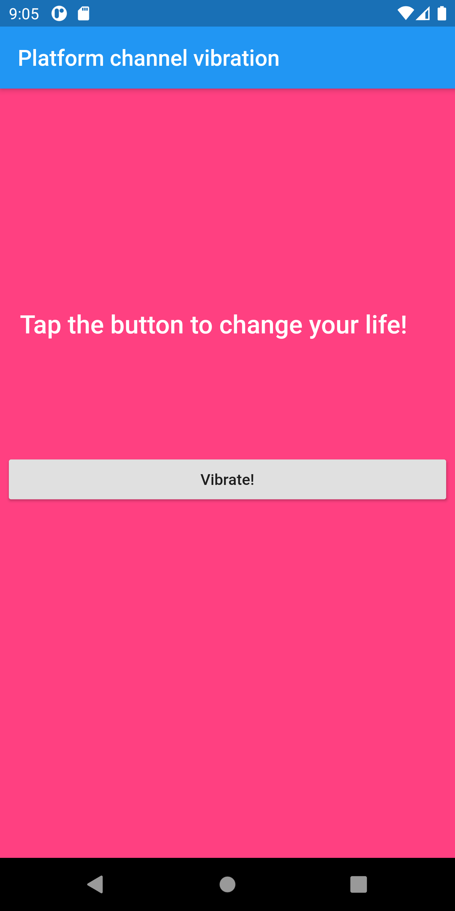

# VD_flutter_training_9

## Platformchannel

This app demonstrates usage of platform channel to commnicate platform specific code and perform a platform specific feature. We are going to vibrate an Android device using platform channels in this example.

# Screenshot

## Note:

This works only on Android only. Please use a real device instead of an emulator to observe vibration. 